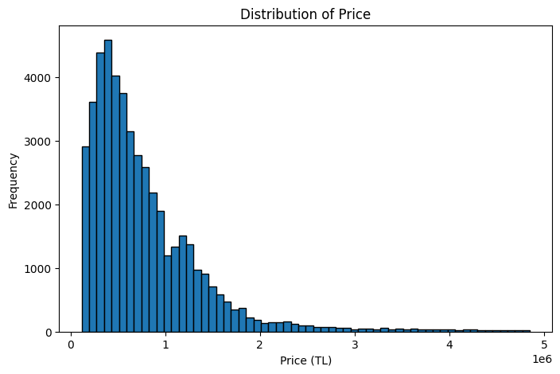
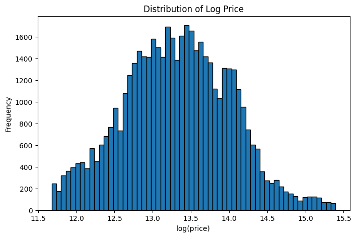
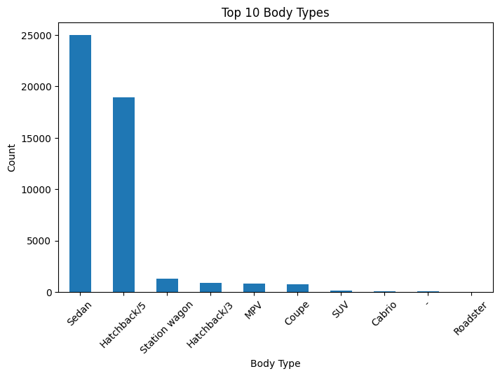
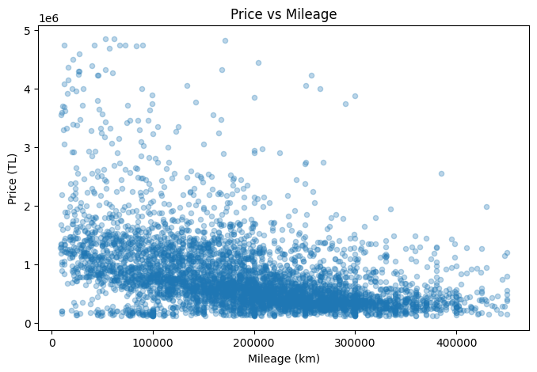
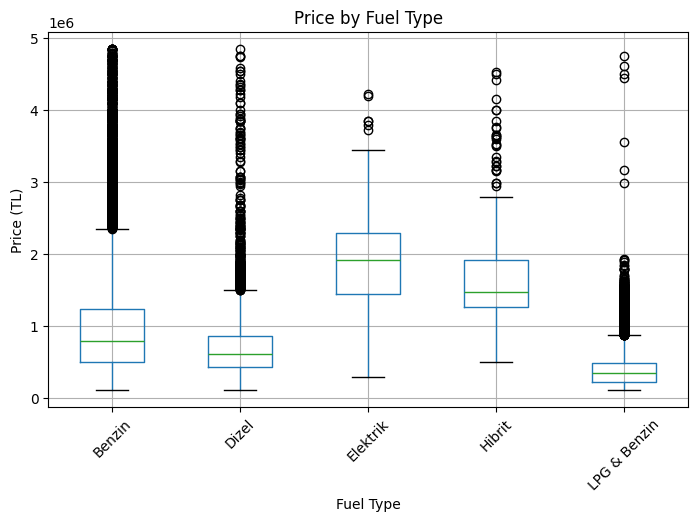
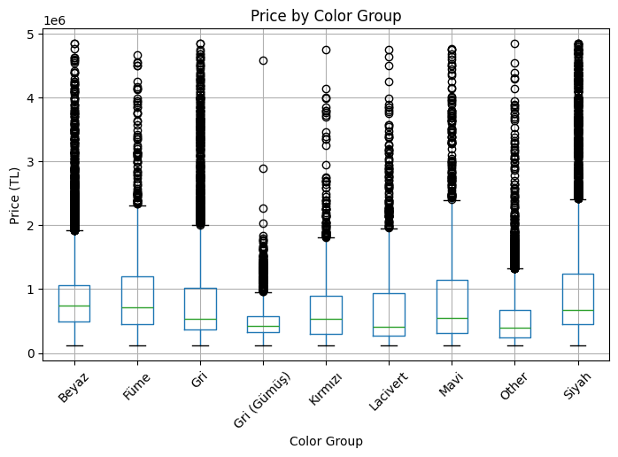

## The Role of Cosmetic Attributes in Used-Car Price Formation: Evidence from the Turkish Second-Hand Market

---

## 1. Project Motivation

Used-car prices are affected by many structural vehicle characteristics such as brand, series, model year, mileage, fuel type, transmission, and body type. However, cosmetic attributes such as color are also widely believed to influence resale value.

The goal of this project is to move beyond consumer intuition and examine whether cosmetic attributes truly have a meaningful effect on used-car prices once the main structural factors are taken into account. Using a real-world dataset of Turkish second-hand car listings, this project applies the data science pipeline from data collection and cleaning to exploratory analysis and formal hypothesis testing.

---

## 2. Data Pipeline & Methodology

### 2.1 Data Sources

* **Kaggle Used Car Prices Dataset (arabam.com-based)**
  → Provides listing-level data such as price, brand, series, model, year, mileage, fuel type, transmission, body type, color, engine volume, engine power, and seller type

* **Official 2026 Motor Vehicle Tax (MTV) tariff from GİB**
  → Used as an external enrichment source to construct an estimated ownership-cost related variable

---

### 2.2 Data Cleaning & Preparation

To ensure reliable analysis, the dataset was carefully preprocessed:

* Renamed column names into analysis-friendly format
* Removed duplicate records
* Dropped observations with missing values in the main analytical variables
* Removed invalid price and mileage values
* Filtered unrealistic production years
* Trimmed extreme outliers using percentile-based filtering
* Applied log transformation to price and mileage

After cleaning, the dataset contained **48,062 observations**, which formed the basis of the exploratory analysis and hypothesis testing.

---

### 2.3 Data Enrichment

To satisfy the enrichment requirement and incorporate an external structural factor, the dataset was enriched using official 2026 **Motor Vehicle Tax (MTV)** information published by the Revenue Administration of Türkiye (GİB).

Since the dataset does not include a listing date, macroeconomic variables such as exchange rates or fuel prices could not be matched meaningfully at the observation level. Instead, the enrichment was based on variables already present in the dataset:

* Vehicle age was derived from production year
* Engine-volume brackets were created using engine displacement
* Official MTV tariff categories were used to assign an **estimated annual MTV value**

Because the legal GİB tariff also depends on a vehicle-value bracket and the dataset does not contain the exact official tax-base value, **listing price was used as a proxy** for this bracket. Therefore, the resulting variable is interpreted as **estimated annual MTV** rather than the exact legal tax liability.

Estimated MTV values were assigned to **46,947 vehicles**.

---

## 3. Exploratory Data Analysis (EDA)

### 3.1 Price Distribution

*Objective: Understand how used-car prices are distributed.*



**Insights:**

* The price distribution is strongly **right-skewed**
* A relatively small number of highly priced vehicles pull the distribution to the right
* This supports using a **log-transformed price** variable in later analysis

---

### 3.2 Log-Price Distribution

*Objective: Examine whether the log transformation makes price more suitable for statistical analysis.*



**Insights:**

* The log transformation makes the price distribution more symmetric
* This improves interpretability and supports the regression-based hypothesis testing stage

---

### 3.3 Mileage and Price

*Objective: Analyze the relationship between mileage and price.*



**Insights:**

* There is a general negative relationship between mileage and price
* Higher-mileage vehicles tend to have lower prices
* However, there is still substantial variation within each mileage range

---

### 3.4 Price by Transmission

*Objective: Compare price levels across transmission types.*



**Insights:**

* Transmission type creates visible price differences
* This suggests that structural vehicle characteristics have a meaningful role in price formation

---

### 3.5 Price by Color Group

*Objective: Examine whether raw price differences exist across color groups.*



**Insights:**

* Some visible raw differences across color groups appear in the data
* However, these differences may partly reflect underlying variation in brand, mileage, series, or vehicle age rather than a pure color effect

---

### 3.6 Estimated MTV Distribution

*Objective: Examine the distribution of the enriched ownership-cost variable.*



**Insights:**

* Estimated MTV values are concentrated in lower tax ranges
* A smaller number of vehicles fall into much higher tax brackets
* This suggests that the dataset is dominated by lower- and mid-tax vehicles, with fewer high-engine, high-tax cars

---

## 4. Statistical Hypothesis Testing

To validate the findings from exploratory data analysis, formal statistical tests were conducted.

---

### Test 1: Raw Price Differences Across Color Groups

- **Null Hypothesis ($H_0$):** There is no significant difference in price distributions across color groups.  
- **Alternative Hypothesis ($H_1$):** At least one color group has a significantly different price distribution.  

- **Test Used:** Kruskal–Wallis Test  
- **Statistic:** 4810.14  
- **Result:** p < 0.001  

**Conclusion:**  
The null hypothesis is rejected. Raw price distributions differ significantly across color groups. However, this result does not control for structural vehicle characteristics.

---

### Test 2: Additional Explanatory Power of Color After Controlling for Structural Factors

- **Null Hypothesis ($H_0$):** Color does not provide additional explanatory power once structural characteristics are controlled for.  
- **Alternative Hypothesis ($H_1$):** Color provides additional explanatory power after controlling for structural characteristics.  

- **Test Used:** Nested OLS Regression Model Comparison  
- **Control Variables:** brand, series group, year, mileage, fuel type, transmission, and body type  
- **Nested Model p-value:** 2.14 × 10⁻¹⁴  
- **Restricted Model Adjusted R²:** 0.92648  
- **Full Model Adjusted R²:** 0.92662  
- **Δ Adjusted R²:** 0.00014  

**Conclusion:**  
The null hypothesis is rejected statistically. Color does add explanatory power after controlling for structural factors. However, the improvement in model fit is extremely small, which indicates that the practical contribution of color is very limited.

---

### Overall Interpretation

The statistical results suggest that color is **statistically significant** but **substantively weak**. In other words, although color is not completely irrelevant, its contribution to explaining used-car prices is tiny compared with major structural variables such as brand, year, mileage, transmission, fuel type, and body type.

---

## 5. Key Findings

* Used-car prices are strongly shaped by **structural vehicle characteristics**
* Raw price differences across colors are statistically significant
* After controlling for structural factors, color remains statistically significant
* However, the practical effect of color is **extremely small**
* The results support the expectation that cosmetic attributes have only a **limited marginal role** in price formation

---

## 6. Interpretation

This project shows that cosmetic features such as color may influence used-car prices at a statistical level, but they do not meaningfully change the overall explanatory structure of the pricing model.

The increase in adjusted R² after adding color was only **0.00014**, which means that structural variables dominate price formation. Therefore, while consumers may perceive color as important, the market appears to price used cars primarily based on core characteristics such as brand, age, mileage, fuel type, transmission, and body type.

---

## 7. Project Structure

```text
derinalc_dsa210/
│
├── DATA_COLLECTITON_EDA_HYPOTHESIS_TEST.ipynb   # Main notebook
├── DSA210_Project_Proposal_DERIN_ALACAL_35835.pdf
├── README.md
├── requirements.txt
├── outputs/
│   ├── figures/
│   └── tables/
